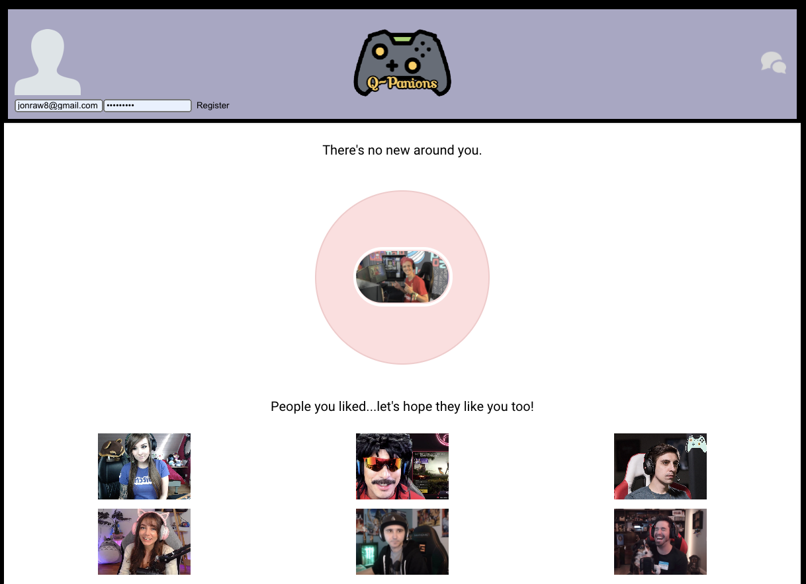

# Q-Panions
Heroku Link: https://polar-reef-22832.herokuapp.com/

## Technologies used
- Ruby on Rails : Back-end framework used for User-Authorization

- React Js : Interactive front-end framework

- SQL: Database 
- Heroku: Deployment website
- GitHub: REpository hosting service

## My Approach
My general approach to creating this app started with what I wanted this app to accomplish and who I wanted to target. After I narrowed the target audience I then started on some of the back-end work. I tried a few new things that were not taught in class, for example I used a cornerstone gem called "devise" that takes care of all the controllers necessary for user creation. I ran into some errors so I switched my focus to the front-end work. I was able to create and interactive front-end used to find other users on the app with the ability to connect through mutual like. 

 With the front end basically set up I had to do more research on the backend work. Not being too well versed in backend work I came to the conclusion after talking with my team leader that maybe it wasn't the best idea to use something I didn't fully understand so I went back to old zoom videos that J made showing us how she incorporated auth with react. 

While running into error after error I decided to depoloy my app to heroku and style my app so I could get that out of the way.

## Wireframes

    
## UserStories
- Visitor arrives on landing page with ability to sign-in or register.
- Visitor makes account with prefrence of what platform they have
- Option to import avatar photo
- Option to fillout bio
- User goes on seach page to find gamers in a tinder like swipe.
- At end of search the app says no more people to search and shows who you liked.
- If there is a mutal like the ability to chat is created.

## Unsolved Problems and Hurdles
- First off I want to say I really tried to do a project to push my knowledge to the limit. My thought process was that if I could make a tinder like app that would really take everything I have learned till this point and then some. My first hurdle was that I actually felt like I had half of the app done mostly with backend. I used devise and ran into problems that I could not get past and every TA that tried to help was having similar problems and couldn't help me solve the problem. So on Wednesday I decided to cut my losses and start over and try getting the front-end portion of my app out of the way which work fairly well till I ran into more errors that seemed to be a never ending rabbit hole only to find out that it was a syntax error or mis-spelling. These errors really caught up to me and even as I type this out I am still trying to solve my in app errors along with Heroku deployment. I am getting "h10" error and I am trying everything that fellow classmates are posting in slack along with trying to follow stackover flow threads to no avail.